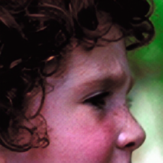

# DTKD

## [KBS 2025] 《Reliable Image Super-Resolution Using Dual-Teacher Knowledge Distillation》

------

> **Abstract:** *Reliable image super-resolution (SR) requires recovery of accurate textures and trustworthy details for real-world applications. It is challenging for SR methods to achieve both high reconstruction fidelity and desirable perceptual quality, even at the cost of excessive computational complexity. As a model-compression technique, knowledge distillation (KD) provides a solution for training an efficient lightweight student model with the guidance of a high-performance teacher network. However, untrustworthy teachers that generate false textures will increase generalization errors in SR KD, resulting in a performance detriment of their student. To address these issues, we present a theoretical analysis of errors that arise in SR KD and discuss various conditions for distinguishing \``good’’ teachers that generate reliable and learnable textures. Based on our theoretical criteria, we propose a dual-teacher KD (DTKD) framework that incorporates both fidelity and perceptual teachers to train lightweight and balanced SR student models. To reduce errors in KD training, we design plug-in modules of image entropy routing and two attention loss functions. To construct a ``good'' perceptual teacher for KD training, we further design an edge-guided SR network, called EdgeSRN, which replaces generative adversarial networks by incorporating edge-enhanced learning to reduce artifacts. Extensive evaluations regarding both the reconstruction accuracy and perceptual quality verify that student models trained using the proposed DTKD outperform other state-of-the-art SR methods with fewer network parameters and lower computation costs.*

## Datasets

| Dataset          | Link                                                         |
| :----------------------: | :------------------------------------------------------------: |
| DIV2K | [[**Website**](https://data.vision.ee.ethz.ch/cvl/DIV2K/)] |
| Set5+Set14+BSD100+Urban100+Manga109+RealSRSet | [[**Google**](https://drive.google.com/file/d/1uCeHtVO1_Mnc3KnOKzLd0JyOUhzzKKNo/view?usp=sharing)] |

## Example

<table>
  <tr>
    <td align="center">  </td>
    <td align="center">  </td>
    <td align="center">  </td>
  </tr>
  <tr>
    <td align="center">  </td>
    <td align="center">  </td>
    <td align="center">  </td>
  </tr>
  <tr>
    <td align="center">  </td>
    <td align="center">  </td>
    <td align="center">  </td>
  </tr>
  <tr>
    <td align="center">  </td>
    <td align="center">  </td>
    <td align="center">  </td>
  </tr>
  <tr>
    <td align="center"><p><b>Input</b></p></td>
    <td align="center"><p><b>DTKD-RFDN</b></p></td>
    <td align="center"><p><b>DTKD-LBNet</b></p></td>
  </tr>
</table>


## Usage

#### Pre-trained Models

- **DTKD-LBNet** → [DTKD-LBNet.pth](https://drive.google.com/file/d/18saECAlz6mc7_neo8_uLeBrc7xs5UKVf/view?usp=sharing)
- **DTKD-RFDN** → [DTKD-RFDN.pth](https://drive.google.com/file/d/1Tu9VH0FmWyMTTwe8rqQt3gq_U2mUZGY3/view?usp=share_link)
- **DTKD-LBNet-perceptual** → [DTKD-LBNet-perceptual.pth](https://drive.google.com/file/d/1DrVEb2exzgO17ZbtoaJZctgTiqRaiuMo/view?usp=sharing)
- **DTKD-RFDN-perceptual** → [DTKD-RFDN-perceptual.pth](https://drive.google.com/file/d/1jQv0Kj8aT_PGUi4LzWppiGPpXQtq15uG/view?usp=sharing)
- **EdgeSRN** → [EdgeSRN_x4.pth](https://drive.google.com/file/d/1Fqr7RqSJk-fSUw9YMpCg2MZnsBhynFWJ/view?usp=sharing)
- **SwinIR-S** → [lightweightSR_SwinIRx4.pth](https://drive.google.com/file/d/1Fqr7RqSJk-fSUw9YMpCg2MZnsBhynFWJ/view?usp=sharing)

#### Visual Results

- **DTKD-LBNet** → [DTKD-LBNet_x4](https://drive.google.com/file/d/18saECAlz6mc7_neo8_uLeBrc7xs5UKVf/view?usp=sharing)
- **DTKD-RFDN** → [DTKD-RFDN_x4](https://drive.google.com/file/d/1Tu9VH0FmWyMTTwe8rqQt3gq_U2mUZGY3/view?usp=share_link)
- **DTKD-LBNet-perceptual** → [DTKD-LBNet-perceptual_x4](https://drive.google.com/file/d/1DrVEb2exzgO17ZbtoaJZctgTiqRaiuMo/view?usp=sharing)
- **DTKD-RFDN-perceptual** → [DTKD-RFDN-perceptual_x4](https://drive.google.com/file/d/1jQv0Kj8aT_PGUi4LzWppiGPpXQtq15uG/view?usp=sharing)
- **EdgeSRN** → [EdgeSRN_x4](https://drive.google.com/file/d/1Fqr7RqSJk-fSUw9YMpCg2MZnsBhynFWJ/view?usp=sharing)

#### Environment

```bash
torch
torchvision
easydict
pandas
numpy
scipy
matplotlib
Pillow
opencv-python
scikit-image
```

#### Install

```bash
git clone https://github.com/lizhangray/DTKD.git
pip install -r requirements.txt
```

#### Download Datasets and Pre-trained Models to Prepare Your Directory Structure

```bash
 DTKD
    |- assets
    |- Checkpoints
        |- EdgeSRN
            |- EdgeSRN_x4.pth
        |- LBNet
            |- DTKD-LBNet.pth
            |- DTKD-LBNet-perceptual.pth
        |- RFDN
            |- DTKD-RFDN.pth
            |- DTKD-RFDN-perceptual.pth
        |- SwinIR
            |- lightweightSR_SwinIRx4.pth
    |- Datasets
    |- Datasets2023
        |- GT
            |- BSD100
            |- Manga109
                ....
        |- GTmod12
            |- BSD100_GTmod12
            |- Manga109_GTmod12
                ....
        |- GTmod12_LRx4
            |- BSD100_LRbicx4
            |- Manga109_LRbicx4
                ....
        |- RealSRSet
        ....
    |- Model
    |- Utils
    |- demo.sh
    |- main.py
    |- requirements.txt
    |- Trainer.py
```

#### How To Test

```bash
python main.py --Train False ----model_name NAME_OF_MODEL --checkpoint CHECKPOINT_PATH --test_folder TESTSET_PATH

# e.g., test DTKD-RFDN in Set5
python main.py --Train False --model_name RFDN --checkpoint DTKD-RFDN.pth --test_folder Datasets2023/GTmod12_LRx4/Set5_LRbicx4

# e.g., test DTKD-LBNet in Set5
python main.py --Train False --model_name LBNet --checkpoint DTKD-LBNet.pth --test_folder Datasets2023/GTmod12_LRx4/Set5_LRbicx4

# e.g., test DTKD-RFDN in Urban100
python main.py --Train False --model_name RFDN --checkpoint DTKD-RFDN.pth --test_folder Datasets2023/GTmod12_LRx4/Urban100_LRbicx4

# e.g., test DTKD-LBNet in Urban100
python main.py --Train False --model_name LBNet --checkpoint DTKD-LBNet.pth --test_folder Datasets2023/GTmod12_LRx4/Urban100_LRbicx4
```

There are four parameters that must be provided:

`'--Train', defalt=False`

`'--model_name', help='(RFDN | LBNet | EdgeSRN | SwinIR)'`

`'--checkpoint', help='load pretrained weight from checkpoint', such as 'DTKD-RFDN.pth'`

`'--test_folder', help='load testset from folder', such as 'Datasets2023/GTmod12_LRx4/Set5_LRbicx4'`

## Citation

Please cite this paper in your publications if it is helpful for your tasks.

```tex
@artical{li2025reliable,
    author    = {xxx},
    title     = {Reliable Image Super-Resolution Using Dual-Teacher Knowledge Distillation},
    booktitle = {xxx},
    year      = {2025}
}

```
